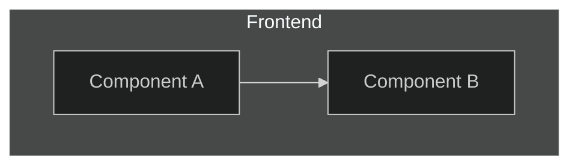
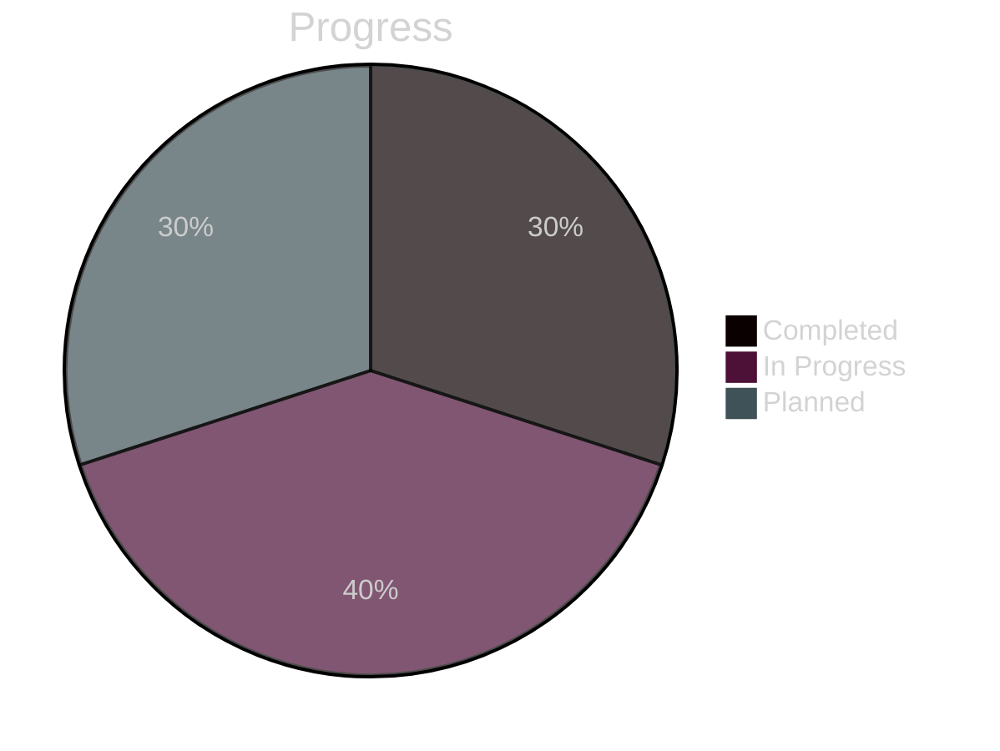

# ImagN Documentation Style Guide

This guide establishes consistent visualization standards for all ImagN project documentation.

## Mermaid Diagram Standards

### Theme Configuration

All Mermaid diagrams should use the dark theme configuration:

```mermaid
%%{init: {'theme':'dark'}}%%
```

### Color Palette

Use these specific colors for different diagram components:

- Primary Features: `#2f3545` (Desaturated Deep Blue-Gray)
- Secondary Features: `#3a4255` (Muted Medium Blue-Gray)
- Video Processing: `#383344` (Desaturated Deep Purple-Gray)
- Workflow Management: `#4a4339` (Muted Deep Orange-Gray)
- Advanced Features: `#463834` (Desaturated Burnt Orange-Gray)
- Frontend Components: `#2f3545` (Muted Indigo-Gray)
- Backend Components: `#403339` (Desaturated Deep Pink-Gray)
- External Services: `#4a4339` (Muted Deep Orange-Gray)
- Refactoring Tasks: `#374538` (Desaturated Deep Green-Gray)

### Typography

- Use Title Case for node labels
- Keep labels concise (2-4 words)
- Use brackets [] for all node labels

### Layout Guidelines

#### Flow Diagrams
- Use `graph TD` for top-down process flows
- Use `graph LR` for left-right relationship diagrams
- Use `graph TB` for technical architecture

#### Subgraphs
- Group related components using subgraphs
- Use clear, descriptive subgraph titles

Example:


### Progress Visualization

Use pie charts for progress tracking with consistent color coding:



## Document Structure

### Headings Hierarchy
- H1: Document Title
- H2: Major Sections
- H3: Subsections
- H4: Detailed Topics

### Content Organization
1. Start with a brief overview
2. Follow with main content sections
3. Include examples where applicable
4. End with relevant notes or references

## Best Practices

1. **Consistency**
   - Maintain consistent styling across all diagrams
   - Use the same color scheme for similar components
   - Follow the same layout patterns for similar information

2. **Readability**
   - Keep diagrams focused and uncluttered
   - Use appropriate spacing between nodes
   - Include legends when necessary

3. **Maintainability**
   - Comment complex diagram sections
   - Document any custom styling
   - Keep diagrams modular and focused

## Notes
- Always preview diagrams to ensure proper rendering
- Update this guide as new visualization needs emerge
- Ensure accessibility by using sufficient contrast ratios