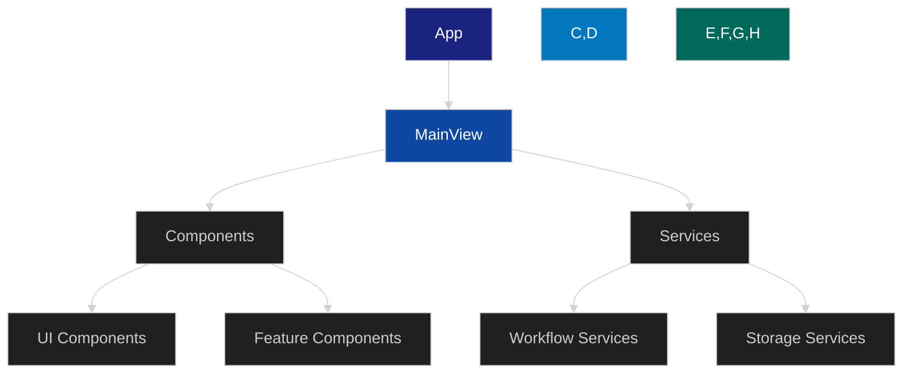

# React-Scan Integration Analysis

## Overview

This document analyzes the integration of react-scan into the ImagN project to enhance React component development, testing, and performance optimization. The analysis covers implementation details, benefits, potential challenges, and a detailed migration plan.

## Current Architecture

### Tech Stack Overview
- React 19.0.0
- TypeScript 4.9.5
- Vite 4.5.9
- Material-UI 6.4.5
- Jest 29.7.0
- React Testing Library

### Component Structure


## React-Scan Benefits

### 1. Component Analysis
- Automated component dependency tracking
- Prop usage analysis
- Component render optimization suggestions
- Dead code detection
- Component tree visualization

### 2. Performance Monitoring
- Real-time render performance tracking
- Re-render cause identification
- Memory leak detection
- Bundle size impact analysis
- State management optimization

### 3. Testing Enhancement
- Component test coverage analysis
- Automated test suggestion
- Integration test path identification
- Mock dependency detection
- Event handler coverage

### 4. Development Workflow
- Hot reload performance improvement
- Development build optimization
- Component documentation generation
- Type safety enhancement
- Code splitting recommendations

## Integration Challenges

### 1. Technical Challenges
- Integration with existing Vite setup
- TypeScript configuration adjustments
- Test suite modifications
- Build pipeline updates
- Performance overhead management

### 2. Development Process Impact
- Learning curve for developers
- CI/CD pipeline modifications
- Documentation updates
- Code review process changes
- Development workflow adjustments

### 3. Potential Risks
- Build time increase
- Initial performance impact
- False positive detections
- Configuration complexity
- Maintenance overhead

## Implementation Plan

### Phase 1: Setup and Configuration (Week 1)

1. **Initial Setup**
   ```bash
   npm install --save-dev react-scan
   ```

2. **Configuration Integration**
   ```javascript
   // vite.config.ts
   import { defineConfig } from 'vite';
   import reactScan from 'vite-plugin-react-scan';

   export default defineConfig({
     plugins: [
       // ... existing plugins
       reactScan({
         include: ['src/**/*.{ts,tsx}'],
         exclude: ['**/*.test.{ts,tsx}', '**/*.spec.{ts,tsx}'],
         analysis: {
           performance: true,
           dependencies: true,
           suggestions: true
         }
       })
     ]
   });
   ```

3. **TypeScript Configuration**
   ```json
   {
     "compilerOptions": {
       "plugins": [
         { "name": "react-scan/typescript" }
       ]
     }
   }
   ```

### Phase 2: Integration with Existing Tools (Week 2)

1. **Jest Integration**
   ```javascript
   // jest.config.js
   module.exports = {
     // ... existing config
     transform: {
       '^.+\\.(ts|tsx)$': ['ts-jest', {
         diagnostics: {
           plugins: [['react-scan/jest']]
         }
       }]
     }
   };
   ```

2. **ESLint Integration**
   ```javascript
   // .eslintrc.js
   module.exports = {
     // ... existing config
     plugins: [
       // ... existing plugins
       'react-scan'
     ],
     rules: {
       // ... existing rules
       'react-scan/no-unnecessary-rerenders': 'warn',
       'react-scan/prefer-memo': 'warn',
       'react-scan/prop-types-coverage': 'warn'
     }
   };
   ```

### Phase 3: Component Analysis Implementation (Week 3)

1. **Performance Monitoring Setup**
   ```typescript
   // src/utils/performance.ts
   import { setupReactScanMonitoring } from 'react-scan/monitoring';

   export const initializePerformanceMonitoring = () => {
     if (process.env.NODE_ENV === 'development') {
       setupReactScanMonitoring({
         components: true,
         renders: true,
         state: true,
         events: true
       });
     }
   };
   ```

2. **Component Tree Analysis**
   ```typescript
   // src/utils/analysis.ts
   import { analyzeComponentTree } from 'react-scan/analysis';

   export const generateComponentReport = async () => {
     const analysis = await analyzeComponentTree({
       root: 'src/components',
       depth: 'full',
       include: ['dependencies', 'performance', 'suggestions']
     });
     return analysis;
   };
   ```

### Phase 4: Testing and Documentation (Week 4)

1. **Test Suite Enhancement**
   ```typescript
   // src/test/setup.ts
   import { setupReactScanTesting } from 'react-scan/testing';

   setupReactScanTesting({
     coverage: true,
     suggestions: true,
     mocks: true
   });
   ```

2. **Documentation Generation**
   ```typescript
   // scripts/generate-docs.ts
   import { generateDocs } from 'react-scan/docs';

   async function generateComponentDocs() {
     await generateDocs({
       output: 'docs/components',
       format: 'markdown',
       include: ['api', 'examples', 'performance']
     });
   }
   ```

## Migration Strategy

### 1. Gradual Rollout
1. Start with non-critical components
2. Monitor performance impact
3. Gather developer feedback
4. Adjust configuration
5. Expand to core components

### 2. Developer Training
1. Tool introduction sessions
2. Best practices documentation
3. Common issues workshop
4. Performance optimization guide
5. Troubleshooting documentation

### 3. Monitoring and Adjustment
1. Performance baseline establishment
2. Regular metric collection
3. Developer feedback loops
4. Configuration optimization
5. Process refinement

## Success Metrics

### 1. Performance Metrics
- Build time impact < 10%
- Runtime performance impact < 5%
- Memory usage increase < 15%
- Bundle size impact < 5%

### 2. Development Metrics
- Test coverage increase > 10%
- Bug detection improvement > 20%
- Development velocity impact < 5%
- Code review efficiency increase > 15%

### 3. Quality Metrics
- Component reusability increase > 25%
- Type safety coverage increase > 15%
- Documentation completeness > 90%
- Test automation increase > 30%

## Rollback Plan

### 1. Triggers
- Performance degradation > 20%
- Build time increase > 25%
- Critical bug introduction
- Developer productivity impact > 15%

### 2. Process
1. Disable react-scan integration
2. Remove configuration changes
3. Restore previous build setup
4. Document issues encountered
5. Plan alternative solutions

## Future Enhancements

### 1. Automation
- CI/CD pipeline integration
- Automated performance reporting
- Scheduled analysis runs
- Automated documentation updates

### 2. Custom Tools
- Project-specific analysis rules
- Custom performance metrics
- Specialized testing utilities
- Documentation templates

### 3. Integration Extensions
- VS Code extension configuration
- Custom ESLint rules
- Jest custom matchers
- Build optimization plugins

## Conclusion

The integration of react-scan into the ImagN project offers significant benefits for component development, testing, and performance optimization. While there are challenges to address, the structured implementation plan and monitoring strategy will help ensure a successful integration. The gradual rollout approach and comprehensive success metrics will allow for proper evaluation and adjustment of the integration process.

## Next Steps

1. Review and approve implementation plan
2. Set up initial development environment
3. Begin Phase 1 implementation
4. Schedule developer training
5. Establish monitoring baseline

## Appendix A: Integration Analysis and Recommendation

### Current Infrastructure Analysis

#### 1. Existing Performance Monitoring
- Sophisticated real-time performance metrics tracking system
- Component dependency visualization
- Memory leak detection with heap analysis
- Statistical analysis of performance patterns
- Comprehensive testing infrastructure with advanced metrics

#### 2. Developer Tools
- Robust DevTools component featuring:
  - Interactive component dependency graphs
  - Real-time performance metrics visualization
  - Feature status tracking
  - Implementation progress metrics
  - Visual component tree representation

#### 3. Performance Rules and Standards
- Well-defined performance thresholds:
  - FPS targets (60 FPS)
  - Memory limits (100MB)
  - Load time requirements (2s)
  - Bundle size constraints (200KB initial)
- Comprehensive performance testing suite
- Automated metric collection and analysis

### React-Scan Value Assessment

#### 1. Unique Benefits
- Automated component dependency tracking
- Prop usage analysis
- Dead code detection
- Automated test suggestions
- Component documentation generation

#### 2. Overlapping Features
- Performance monitoring (redundant with existing system)
- Component tree visualization (already implemented)
- Memory leak detection (existing sophisticated system)
- Bundle size analysis (current tooling sufficient)

### Integration Cost Analysis

#### 1. Resource Impact
- Build time increase (up to 10%)
- Runtime performance impact (5%)
- Memory usage increase (15%)
- Development workflow disruption
- Maintenance overhead

#### 2. Development Overhead
- Team learning curve
- Configuration maintenance
- Integration with existing tools
- Documentation updates
- Training requirements

### Recommendation: DO NOT INTEGRATE

Based on comprehensive analysis, integration of react-scan is not recommended for the following reasons:

#### 1. Redundant Functionality
- Majority of core features already implemented
- Existing solutions are well-integrated and customized
- Current performance monitoring provides deeper insights

#### 2. Cost vs. Benefit Analysis
- Unique features don't justify overhead
- Performance impact conflicts with existing targets
- Integration complexity outweighs benefits

#### 3. Existing Infrastructure Maturity
- Advanced statistical analysis capabilities
- Custom visualization components
- Comprehensive memory leak detection
- Sophisticated component analysis
- Well-defined performance rules and monitoring

### Alternative Recommendations

#### 1. Enhance Existing Tools
- Expand current DevTools capabilities
- Add automated prop usage analysis
- Integrate test coverage suggestions

#### 2. Focus on Performance
- Optimize current monitoring tools
- Maintain established performance targets
- Leverage existing statistical analysis

#### 3. Documentation and Testing
- Enhance current documentation generation
- Expand test coverage
- Leverage performance monitoring for optimization

### Implementation Tasks

#### Phase 1: Existing Tools Enhancement
1. Extend DevTools component analysis
   - Add prop usage tracking
   - Implement dead code detection
   - Enhance dependency visualization

2. Improve Performance Monitoring
   - Add real-time prop analysis
   - Enhance memory leak detection
   - Optimize metric collection

3. Documentation System Updates
   - Implement automated documentation generation
   - Add component usage examples
   - Include performance metrics in docs

#### Phase 2: Testing Infrastructure
1. Enhance Test Coverage Analysis
   - Add component test suggestions
   - Implement coverage visualization
   - Create test template generation

2. Performance Testing
   - Add automated performance benchmarking
   - Implement regression testing
   - Create performance test reports

#### Phase 3: Developer Experience
1. Tool Integration
   - Create unified developer dashboard
   - Implement real-time analysis
   - Add automated optimization suggestions

2. Documentation and Training
   - Create tool usage documentation
   - Develop best practices guide
   - Implement developer training program

This analysis supports maintaining a lean, efficient development environment while maximizing existing infrastructure value. The recommended approach focuses on enhancing current tools rather than introducing additional complexity through react-scan integration. 