# ImagN Task Visualization

This document provides a visual representation of our task lists organized by features and refactoring efforts.

## Developer Tools Implementation

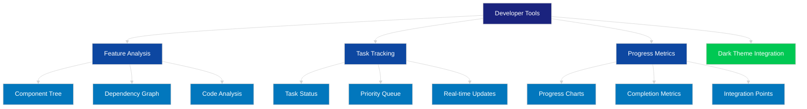

## Feature-based Task Organization

### Image Processing Features

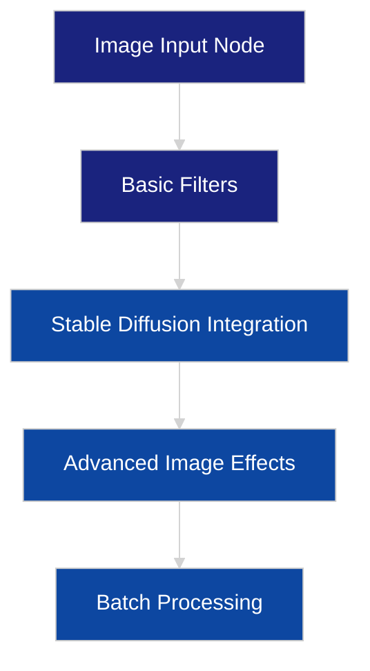

### Video Processing Features

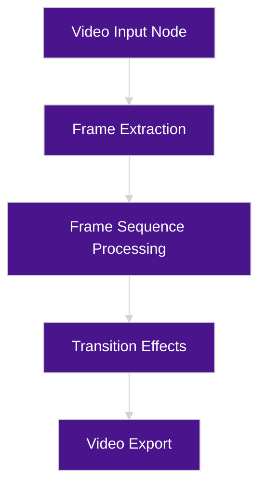

### Workflow Management

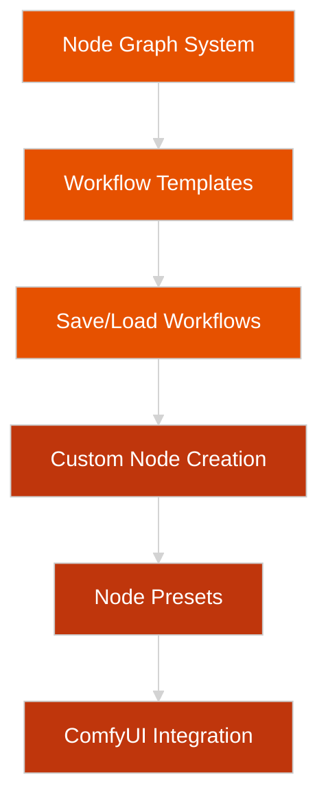

## Refactoring Efforts

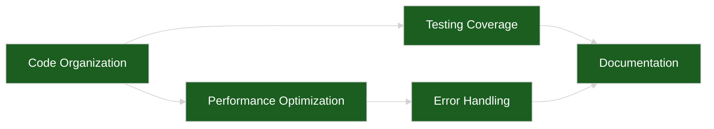

## Implementation Progress

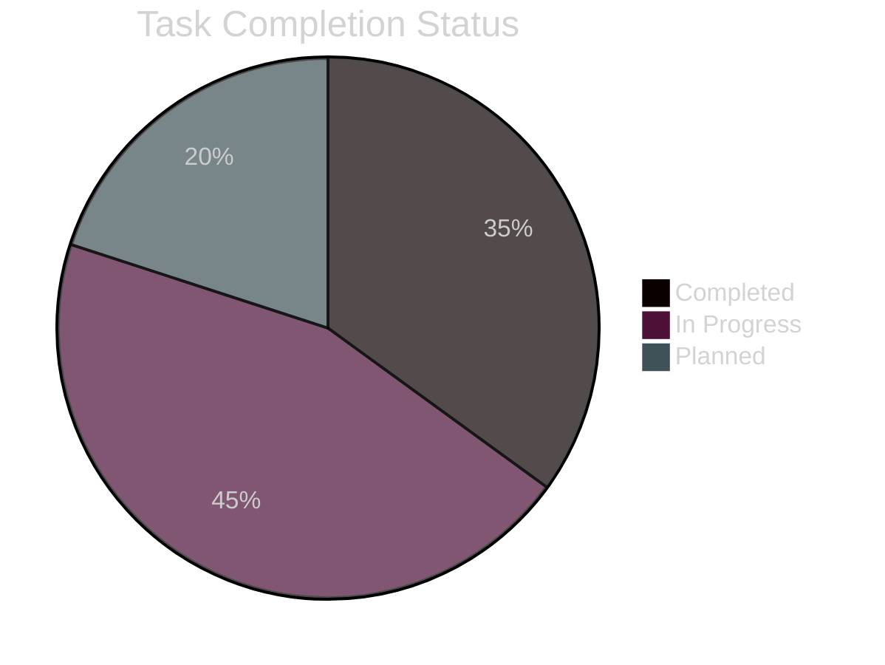

## Dependencies and Integration Points

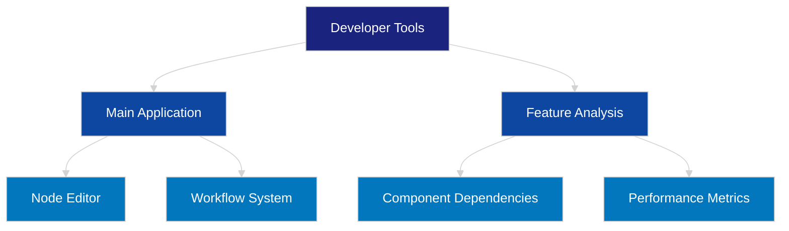

## Local Development Setup Priority

```mermaid
%%{init: {'theme':'dark'}}%%
graph TD
    A[Local Development Setup] --> B[Environment Setup]
    A --> C[Core Architecture]
    A --> D[Testing Infrastructure]
    
    B --> E[Project Structure]
    B --> F[Build System]
    B --> G[Development Tools]
    
    C --> H[Stream Management]
    C --> I[Component System]
    C --> J[State Management]
    
    D --> K[Test Framework]
    D --> L[Test Utilities]
    D --> M[Coverage Setup]
    
    %% Detailed subtasks
    E --> E1[Directory Layout]
    E --> E2[Config Files]
    E --> E3[Git Setup]
    
    F --> F1[Vite Config]
    F --> F2[TypeScript Setup]
    F --> F3[Build Scripts]
    
    G --> G1[ESLint/Prettier]
    G --> G2[Editor Config]
    G --> G3[Dev Server]
    
    H --> H1[Callbags Setup]
    H --> H2[Stream Operators]
    H --> H3[Stream Testing]
    
    I --> I1[Base Components]
    I --> I2[Component Tests]
    I --> I3[Component Utils]
    
    J --> J1[State Streams]
    J --> J2[Action Handlers]
    J --> J3[State Testing]
    
    style A fill:#1a237e,color:#ffffff
    style B,C,D fill:#0d47a1,color:#ffffff
    style E,F,G,H,I,J,K,L,M fill:#0277bd,color:#ffffff
    style E1,E2,E3,F1,F2,F3,G1,G2,G3 fill:#00695c,color:#ffffff
    style H1,H2,H3,I1,I2,I3,J1,J2,J3 fill:#00695c,color:#ffffff
```

## Task Priority List

### 1. Critical Path (P0)
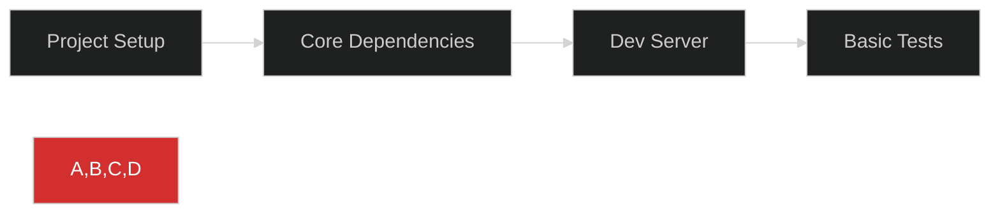

### 2. Development Infrastructure (P1)
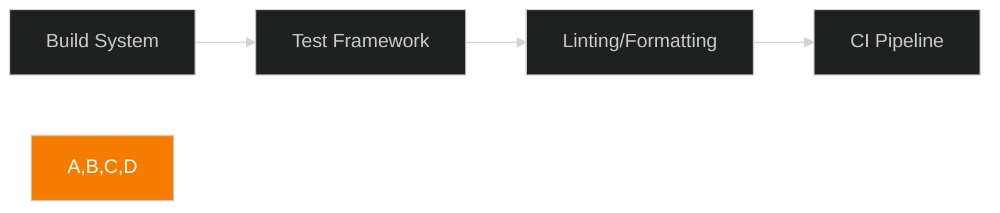

### 3. Core Architecture (P2)
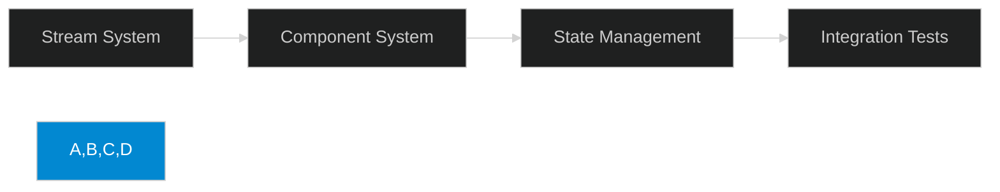

## Implementation Checklist

### P0: Critical Path
- [ ] Initialize project with npm
- [ ] Set up basic directory structure
- [ ] Install core dependencies (Cycle.js, Callbags)
- [ ] Configure Vite dev server
- [ ] Create first test file
- [ ] Implement basic test runner

### P1: Development Infrastructure
- [ ] Configure TypeScript
- [ ] Set up ESLint and Prettier
- [ ] Configure Jest with TypeScript
- [ ] Set up test coverage reporting
- [ ] Create build scripts
- [ ] Configure CI workflow

### P2: Core Architecture
- [ ] Implement stream utilities
- [ ] Create base component structure
- [ ] Set up state management
- [ ] Write integration tests
- [ ] Create test helpers

## Progress Tracking

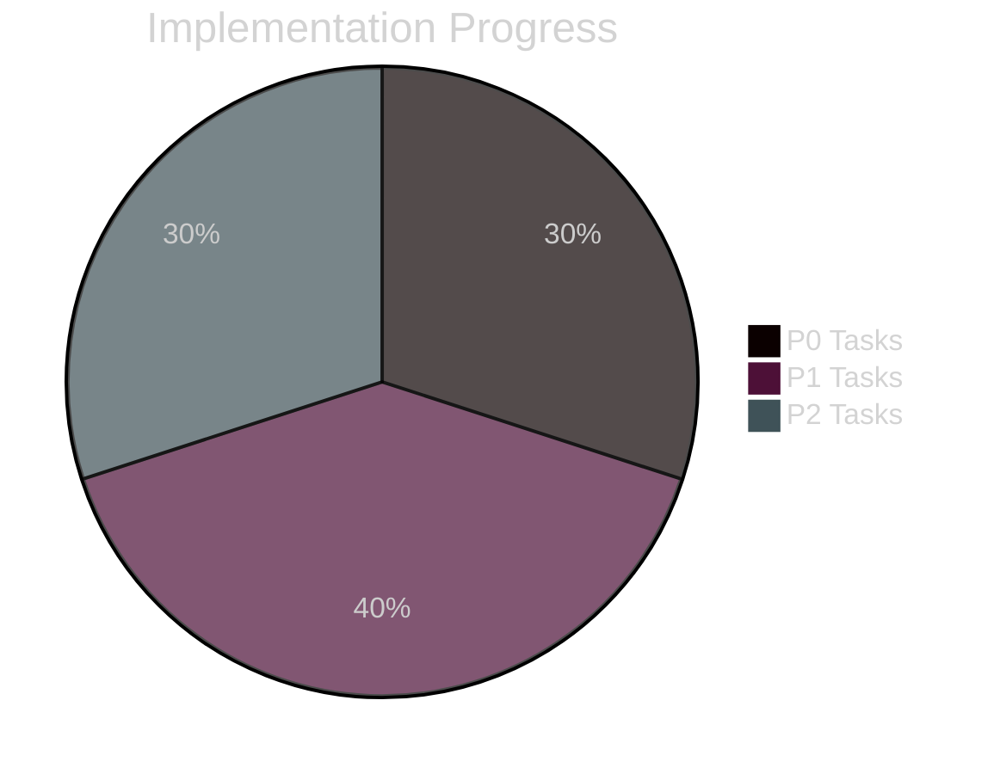

## Dependencies and Integration

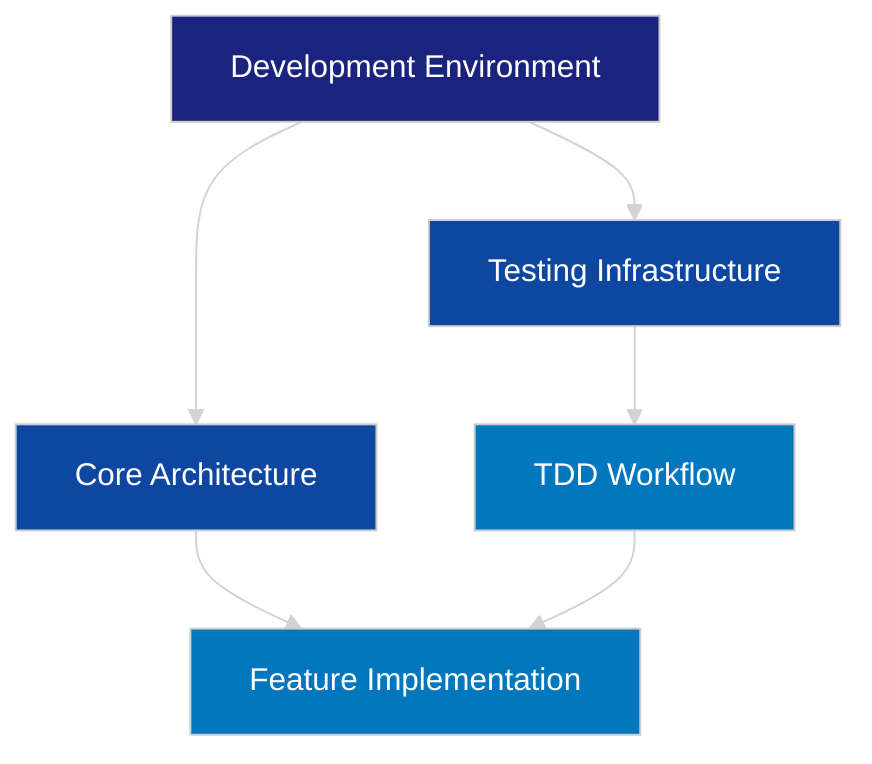

## Next Steps

1. Complete P0 tasks to enable basic development
2. Set up testing infrastructure for TDD
3. Implement core architecture components
4. Begin feature development with tests

## Success Metrics

- All P0 tasks completed
- Development server running
- Basic tests passing
- Core architecture tested
- TDD workflow established