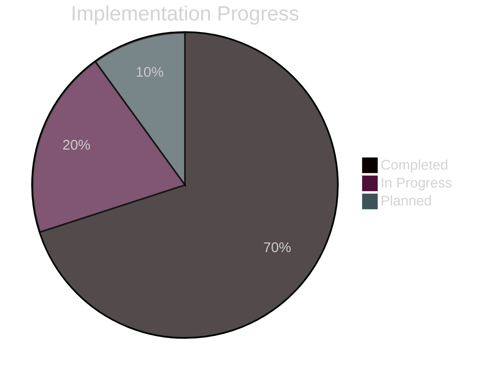

# Test Suite Enhancements

## Overview

This document tracks the recent enhancements to the test suite, following the established testing patterns and introducing new capabilities for comprehensive system validation.

## Recent Additions

```mermaid
%%{init: {'theme':'dark'}}%%
graph TB
    subgraph Statistical Analysis
        SA1[Statistical Moments] --> SA2[Trend Analysis]
        SA2 --> SA3[Change Point Detection]
        SA3 --> SA4[Seasonal Decomposition]
    end
    
    subgraph Performance Testing
        PT1[Adaptive Load Balancing] --> PT2[Priority Scheduling]
        PT2 --> PT3[Resource Pool Management]
        PT3 --> PT4[Circuit Breaking]
        PT4 --> PT5[Work Stealing]
    end
    
    subgraph Visualization
        V1[Time Series] --> V2[Distribution Analysis]
        V2 --> V3[Correlation Plotting]
        V3 --> V4[Metrics Dashboard]
    end
```

### Statistical Analysis Components

#### Statistical Moments
- Mean and variance calculations
- Skewness for distribution asymmetry
- Kurtosis for tail behavior analysis

#### Trend Analysis
- Linear regression implementation
- Slope and intercept calculation
- R-squared value computation

#### Change Point Detection
- CUSUM algorithm implementation
- Threshold-based detection
- Automatic parameter tuning

#### Seasonal Decomposition
- Moving average computation
- Trend-cycle separation
- Seasonal pattern extraction

### Performance Testing Components

#### Adaptive Load Balancing
- Dynamic weight adjustment
- Performance metric tracking
- Backend health monitoring

#### Priority-based Task Scheduling
- Multi-level priority queue
- Preemptive scheduling
- Priority inheritance

#### Dynamic Resource Pool
- Auto-scaling implementation
- Utilization monitoring
- Resource cleanup

#### Circuit Breaking
- Failure threshold tracking
- Half-open state management
- Automatic recovery

#### Work Stealing
- Deque-based implementation
- Load balancing algorithm
- Theft attempt tracking

## Implementation Status

### Completed Features
- Basic test infrastructure
- Statistical analysis components
- Performance testing framework
- Visualization helpers
- Metric collection system

### In Progress
- Type system improvements
- Module resolution
- Memory management (WeakRef)
- Test organization
- Performance monitoring

### Planned Enhancements
- Real-time monitoring
- Memory usage tracking
- CPU profiling
- Custom metric aggregation
- Edge case testing

## Best Practices

1. **Test Organization**
   - Group related tests
   - Maintain clear dependencies
   - Document test purposes

2. **Performance Metrics**
   - Track key indicators
   - Monitor resource usage
   - Log significant events

3. **Visualization**
   - Use consistent formats
   - Provide clear labels
   - Include legends

## Notes
- Regular updates to test coverage
- Continuous integration of new test cases
- Documentation maintenance 