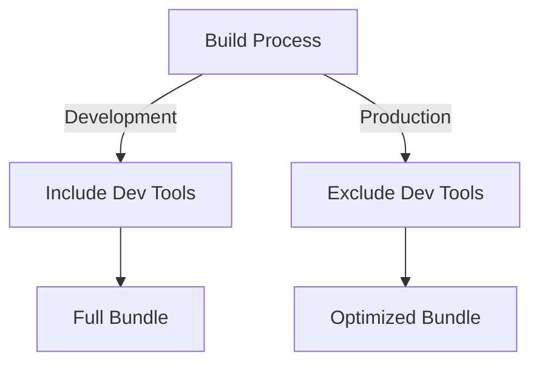

# Development Mode Technical Specification

## Overview

This document outlines the technical approach for ensuring dev tools are only included in development builds and completely excluded from production builds.

## Implementation Strategy

### 1. Build-time Detection



### 2. Module Structure

```
fraop-mvi-dev-tools/
├── src/
│   ├── index.ts           # Main entry point
│   ├── index.dev.ts       # Development-only features
│   └── index.prod.ts      # Production no-op exports
```

### 3. Entry Point Logic

```typescript
// index.ts
if (process.env.NODE_ENV === 'development') {
  module.exports = require('./index.dev');
} else {
  module.exports = require('./index.prod');
}
```

## Bundler Configuration

### 1. Webpack Configuration

```javascript
// webpack.config.js
module.exports = {
  // ...
  plugins: [
    new webpack.DefinePlugin({
      'process.env.NODE_ENV': JSON.stringify(process.env.NODE_ENV)
    })
  ],
  optimization: {
    sideEffects: true,
    usedExports: true
  }
}
```

### 2. Rollup Configuration

```javascript
// rollup.config.js
import replace from '@rollup/plugin-replace';

export default {
  // ...
  plugins: [
    replace({
      'process.env.NODE_ENV': JSON.stringify(process.env.NODE_ENV)
    })
  ]
}
```

## Development Mode Features

### 1. Initialization

```typescript
// index.dev.ts
export function initDevTools(config: DevToolsConfig): void {
  if (!isDevMode()) return;
  
  injectDevTools(config);
  setupHotReload();
  initializePlugins(config.plugins);
}
```

### 2. Hot Module Replacement

```typescript
function setupHotReload(): void {
  if (module.hot) {
    module.hot.accept('./components/DevTools', () => {
      // Re-render dev tools
      reloadDevTools();
    });
  }
}
```

## Production Mode Features

### 1. No-op Implementation

```typescript
// index.prod.ts
export function initDevTools(): void {
  // No-op in production
}

export function analyzeProps(): void {
  // No-op in production
}
```

### 2. Tree Shaking Support

```typescript
// package.json
{
  "sideEffects": false,
  "module": "dist/esm/index.js",
  "main": "dist/cjs/index.js"
}
```

## Build Process

### 1. Development Build


### 2. Production Build


## Integration Examples

### 1. React Application

```typescript
// App.tsx
import { initDevTools } from 'fraop-mvi-dev-tools';

if (process.env.NODE_ENV === 'development') {
  initDevTools({
    target: document.body,
    features: ['propAnalysis']
  });
}
```

### 2. Next.js Application

```typescript
// pages/_app.tsx
if (process.env.NODE_ENV === 'development') {
  import('fraop-mvi-dev-tools').then(({ initDevTools }) => {
    initDevTools({
      target: document.body,
      features: ['propAnalysis']
    });
  });
}
```

## Testing Strategy

### 1. Development Mode Tests

```typescript
describe('Development Mode', () => {
  it('should initialize dev tools', () => {
    process.env.NODE_ENV = 'development';
    const { initDevTools } = require('../src/index');
    expect(initDevTools).toBeDefined();
  });
});
```

### 2. Production Mode Tests

```typescript
describe('Production Mode', () => {
  it('should not include dev tools code', () => {
    process.env.NODE_ENV = 'production';
    const bundle = require('../dist/index');
    expect(Object.keys(bundle)).toHaveLength(0);
  });
});
```

## Security Considerations

1. **Code Stripping**
   - Ensure all development code is removed in production
   - Verify no sensitive information is exposed
   - Check bundle size for unexpected inclusions

2. **Environment Variables**
   - Use secure methods to detect environment
   - Prevent environment spoofing
   - Handle edge cases gracefully

## Verification Checklist

- [ ] Development mode correctly detected
- [ ] Production builds exclude dev tools
- [ ] Bundle size optimized
- [ ] Hot reload working
- [ ] No runtime errors in production
- [ ] Tree shaking effective
- [ ] Source maps working in development 