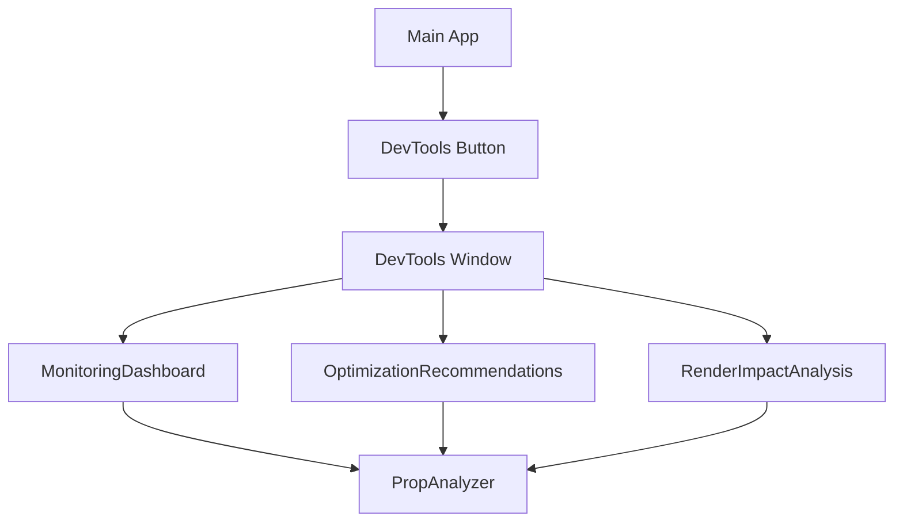
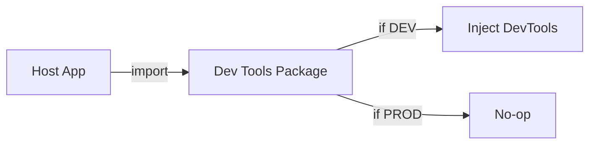
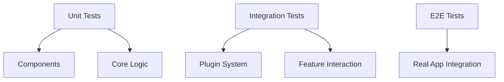

# Dev Tools Migration Plan

## Current Architecture Analysis

### Components Structure


### Current Integration Points
1. **Entry Points**
   - DevTools Button injection
   - Window management
   - React DevTools panel integration

2. **Core Functionality**
   - Prop analysis and tracking
   - Performance monitoring
   - Optimization suggestions
   - Render impact visualization

3. **Dependencies**
   - React core
   - Testing libraries
   - Visualization libraries (recharts)
   - Development mode detection

## Migration Strategy

### Phase 1: Package Isolation

1. **Package Structure**
```
fraop-mvi-dev-tools/
├── src/
│   ├── components/
│   │   ├── DevToolsButton/
│   │   ├── DevToolsWindow/
│   │   ├── MonitoringDashboard/
│   │   ├── OptimizationRecommendations/
│   │   └── RenderImpactAnalysis/
│   ├── core/
│   │   ├── PropAnalyzer/
│   │   ├── PerformanceMonitor/
│   │   └── OptimizationEngine/
│   ├── utils/
│   │   ├── development/
│   │   └── visualization/
│   └── index.ts
├── tests/
├── docs/
└── package.json
```

2. **Development Mode Integration**


### Phase 2: Feature Isolation

1. **Core Features**
   - Prop Analysis Engine
   - Performance Monitoring
   - Optimization Suggestions
   - Visualization Components

2. **Extension Points**
   - Custom analyzers
   - Plugin system
   - Theme customization
   - Configuration API

### Phase 3: Documentation & API Design

1. **Public API**
```typescript
interface DevToolsConfig {
  target: HTMLElement;
  features: string[];
  theme?: ThemeConfig;
  plugins?: Plugin[];
}

function initDevTools(config: DevToolsConfig): void;
```

2. **Plugin System**
```typescript
interface Plugin {
  name: string;
  hooks: {
    onAnalysis?: (data: AnalysisData) => void;
    onOptimization?: (suggestions: Suggestion[]) => void;
    onRender?: (stats: RenderStats) => void;
  };
}
```

## Implementation Plan

### 1. Package Setup (Week 1)
- [ ] Create new repository structure
- [ ] Set up build system (TypeScript, Rollup)
- [ ] Configure testing environment
- [ ] Set up documentation system

### 2. Core Migration (Week 2)
- [ ] Move PropAnalyzer
- [ ] Move visualization components
- [ ] Set up development mode detection
- [ ] Create injection mechanism

### 3. Feature Migration (Week 3)
- [ ] Implement plugin system
- [ ] Move monitoring dashboard
- [ ] Move optimization recommendations
- [ ] Move render impact analysis

### 4. Documentation & Examples (Week 4)
- [ ] API documentation
- [ ] Usage examples
- [ ] Plugin development guide
- [ ] Migration guide

## Integration Guide

### Basic Usage
```typescript
// In your app's entry point
import { initDevTools } from 'fraop-mvi-dev-tools';

if (process.env.NODE_ENV === 'development') {
  initDevTools({
    target: document.body,
    features: ['propAnalysis', 'performance', 'optimization']
  });
}
```

### Plugin Development
```typescript
// Custom plugin example
const customPlugin: Plugin = {
  name: 'custom-analyzer',
  hooks: {
    onAnalysis: (data) => {
      // Custom analysis logic
    }
  }
};
```

## Considerations & Challenges

### 1. Development Mode
- Use webpack's DefinePlugin for environment detection
- Implement tree-shaking friendly exports
- Handle HMR compatibility

### 2. Performance Impact
- Lazy load dev tools components
- Implement efficient prop tracking
- Minimize runtime overhead

### 3. Compatibility
- Support different React versions
- Handle different bundler configurations
- Support various development environments

### 4. Testing Strategy


## Migration Checklist

### Repository Setup
- [ ] Initialize new repository
- [ ] Set up CI/CD
- [ ] Configure package publishing
- [ ] Set up documentation site

### Core Development
- [ ] Migrate core functionality
- [ ] Implement plugin system
- [ ] Set up development mode handling
- [ ] Create build configuration

### Testing & Documentation
- [ ] Migrate test suites
- [ ] Create example projects
- [ ] Write API documentation
- [ ] Create migration guides

### Release & Maintenance
- [ ] Version 1.0.0 release
- [ ] Deprecation notices in original code
- [ ] Support plan
- [ ] Maintenance schedule

## Future Enhancements

1. **Advanced Features**
   - Custom visualization plugins
   - Performance regression detection
   - Automated optimization application
   - State management integration

2. **Tooling Integration**
   - VS Code extension
   - Chrome DevTools extension
   - CLI tools

3. **Analytics & Insights**
   - Performance trending
   - Optimization impact analysis
   - Team collaboration features

## Resources & References

1. **Documentation**
   - API Reference
   - Migration Guide
   - Plugin Development Guide
   - Best Practices

2. **Examples**
   - Basic Integration
   - Custom Plugin Development
   - Advanced Configuration
   - Real-world Use Cases

3. **Community**
   - Contributing Guidelines
   - Code of Conduct
   - Support Channels
   - Feature Requests 