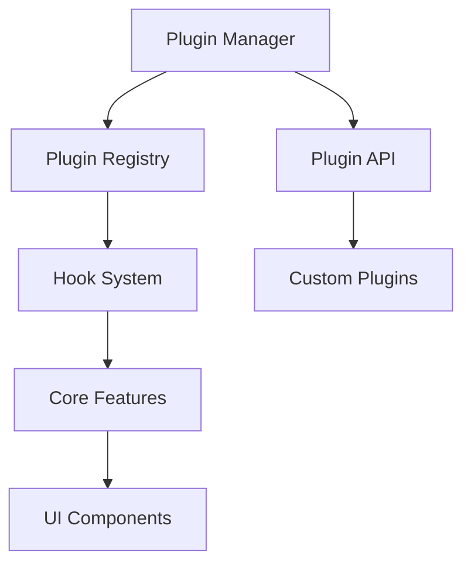
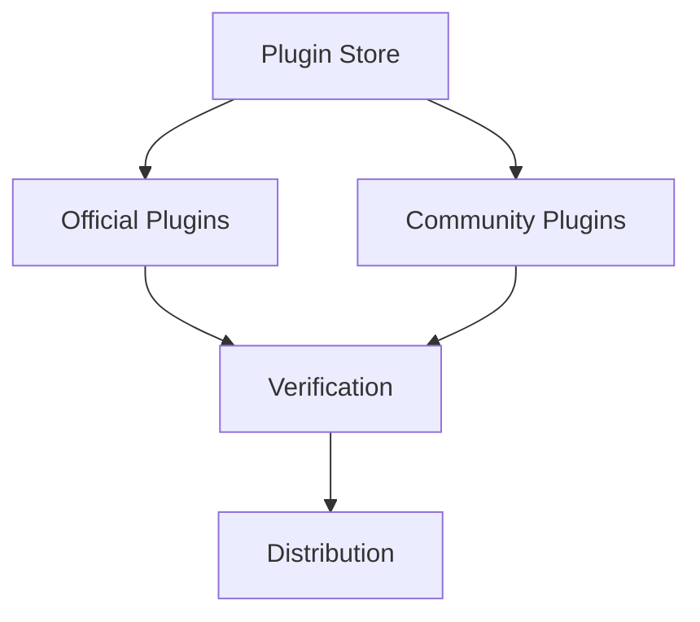

# Plugin System Technical Specification

## Overview

The plugin system enables developers to extend and customize the dev tools functionality through a standardized API.

## Architecture



## Plugin Interface

```typescript
interface Plugin {
  // Required
  name: string;
  version: string;
  
  // Optional
  dependencies?: string[];
  
  // Lifecycle hooks
  hooks: {
    onInit?: () => void | Promise<void>;
    onDestroy?: () => void | Promise<void>;
    
    // Analysis hooks
    onBeforeAnalysis?: (context: AnalysisContext) => void | Promise<void>;
    onAfterAnalysis?: (result: AnalysisResult) => void | Promise<void>;
    
    // UI hooks
    onRender?: (props: any) => React.ReactNode;
    onToolbarRender?: () => React.ReactNode;
    
    // Data hooks
    onDataTransform?: (data: any) => any;
    onMetricsCollect?: () => Metrics;
  };
  
  // Configuration
  config?: {
    priority?: number;
    enabled?: boolean;
    settings?: Record<string, any>;
  };
}
```

## Plugin Manager

### 1. Registration

```typescript
class PluginManager {
  private plugins: Map<string, Plugin>;
  
  register(plugin: Plugin): void {
    this.validatePlugin(plugin);
    this.resolveDepencies(plugin);
    this.plugins.set(plugin.name, plugin);
  }
  
  unregister(pluginName: string): void {
    const plugin = this.plugins.get(pluginName);
    if (plugin?.hooks.onDestroy) {
      await plugin.hooks.onDestroy();
    }
    this.plugins.delete(pluginName);
  }
}
```

### 2. Hook System

```typescript
class HookSystem {
  private hooks: Map<string, Set<Function>>;
  
  async executeHook(name: string, context: any): Promise<void> {
    const hooks = this.hooks.get(name) || new Set();
    for (const hook of hooks) {
      await hook(context);
    }
  }
  
  addHook(name: string, fn: Function): void {
    if (!this.hooks.has(name)) {
      this.hooks.set(name, new Set());
    }
    this.hooks.get(name)!.add(fn);
  }
}
```

## Plugin Development

### 1. Basic Plugin Template

```typescript
const myPlugin: Plugin = {
  name: 'my-custom-plugin',
  version: '1.0.0',
  
  hooks: {
    onInit() {
      console.log('Plugin initialized');
    },
    
    onBeforeAnalysis(context) {
      // Modify analysis context
    },
    
    onAfterAnalysis(result) {
      // Process analysis results
    },
    
    onRender() {
      return <MyCustomView />;
    }
  },
  
  config: {
    priority: 1,
    enabled: true,
    settings: {
      // Custom settings
    }
  }
};
```

### 2. Plugin Communication

```typescript
interface PluginMessage {
  type: string;
  payload: any;
  source: string;
  target?: string;
}

class PluginMessenger {
  send(message: PluginMessage): void {
    this.pluginManager.broadcast(message);
  }
  
  subscribe(type: string, handler: (message: PluginMessage) => void): void {
    this.listeners.set(type, handler);
  }
}
```

## Integration Examples

### 1. Performance Plugin

```typescript
const performancePlugin: Plugin = {
  name: 'performance-metrics',
  version: '1.0.0',
  
  hooks: {
    onMetricsCollect() {
      return {
        renderTime: performance.now(),
        memoryUsage: performance.memory?.usedJSHeapSize
      };
    },
    
    onRender() {
      return <PerformanceMetrics />;
    }
  }
};
```

### 2. Custom Analyzer Plugin

```typescript
const customAnalyzerPlugin: Plugin = {
  name: 'custom-analyzer',
  version: '1.0.0',
  
  hooks: {
    onBeforeAnalysis(context) {
      context.includeCustomMetrics = true;
    },
    
    onAfterAnalysis(result) {
      return {
        ...result,
        customMetrics: calculateCustomMetrics(result)
      };
    }
  }
};
```

## Plugin Store

### 1. Structure



### 2. Plugin Manifest

```typescript
interface PluginManifest {
  name: string;
  version: string;
  description: string;
  author: string;
  repository: string;
  dependencies: Record<string, string>;
  tags: string[];
  category: 'official' | 'community';
}
```

## Security

### 1. Plugin Validation

```typescript
function validatePlugin(plugin: Plugin): void {
  // Validate structure
  validateStructure(plugin);
  
  // Check dependencies
  validateDependencies(plugin);
  
  // Verify permissions
  validatePermissions(plugin);
  
  // Sandbox evaluation
  evaluateInSandbox(plugin);
}
```

### 2. Sandbox Environment

```typescript
class PluginSandbox {
  private context: Record<string, any>;
  
  execute(code: string): any {
    return new Function('context', `
      with (context) {
        ${code}
      }
    `)(this.context);
  }
}
```

## Testing

### 1. Plugin Tests

```typescript
describe('Plugin System', () => {
  it('should register plugins', () => {
    const plugin = createTestPlugin();
    pluginManager.register(plugin);
    expect(pluginManager.get(plugin.name)).toBeDefined();
  });
  
  it('should execute hooks in order', async () => {
    const results: string[] = [];
    const plugin = createTestPlugin({
      hooks: {
        onInit: () => results.push('init'),
        onDestroy: () => results.push('destroy')
      }
    });
    
    await pluginManager.register(plugin);
    await pluginManager.unregister(plugin.name);
    
    expect(results).toEqual(['init', 'destroy']);
  });
});
```

### 2. Integration Tests

```typescript
describe('Plugin Integration', () => {
  it('should work with core features', async () => {
    const plugin = createAnalyzerPlugin();
    await pluginManager.register(plugin);
    
    const analysis = await analyzer.analyze();
    expect(analysis.customMetrics).toBeDefined();
  });
});
```

## Documentation

### 1. Plugin Development Guide
- Setup and installation
- API reference
- Best practices
- Example plugins
- Troubleshooting

### 2. Plugin Store Guide
- Submission process
- Review guidelines
- Version management
- Distribution

## Migration Path

1. **Phase 1: Core Plugin System**
   - Implement basic plugin manager
   - Define hook system
   - Create plugin validation

2. **Phase 2: Official Plugins**
   - Migrate existing features to plugins
   - Create documentation
   - Set up testing infrastructure

3. **Phase 3: Community Support**
   - Launch plugin store
   - Create submission process
   - Set up review system

## Checklist

- [ ] Core plugin system implemented
- [ ] Hook system tested
- [ ] Security measures in place
- [ ] Documentation complete
- [ ] Example plugins created
- [ ] Store infrastructure ready
- [ ] Review process defined
- [ ] Migration guide written 