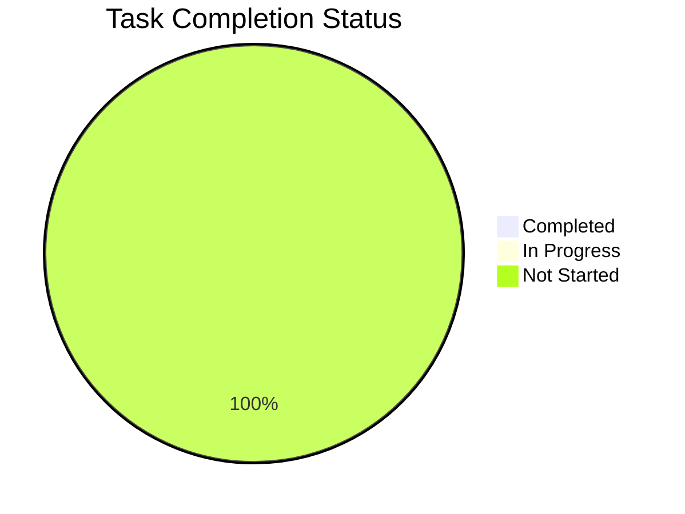
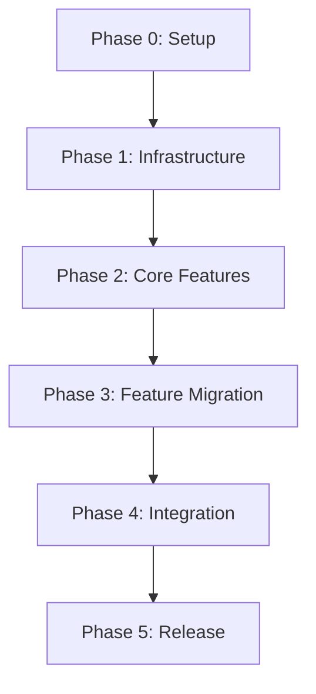

# Dev Tools Migration Task Tracking

## Phase 0: Initial Setup and Planning
### Repository Setup [P0]
- [ ] Initialize new repository at github.com/subtillioN/FRAOP-MVI-Dev-Tools
- [ ] Set up basic project structure
- [ ] Configure TypeScript
- [ ] Set up ESLint and Prettier
- [ ] Create initial README.md
- [ ] Set up GitHub Actions for CI/CD
- [ ] Configure package.json with initial dependencies

### Documentation Setup [P0]
- [ ] Set up documentation site structure
- [ ] Create initial architecture documentation
- [ ] Set up API documentation framework
- [ ] Create contribution guidelines
- [ ] Set up changelog

## Phase 1: Core Infrastructure (Week 1)
### Build System [P1]
- [ ] Configure Rollup for production builds
- [ ] Set up development build process
- [ ] Configure TypeScript paths and aliases
- [ ] Set up source maps
- [ ] Configure bundle size monitoring
- [ ] Set up tree shaking optimization

### Development Mode Infrastructure [P1]
- [ ] Create development mode detection system
- [ ] Implement production mode no-op exports
- [ ] Set up HMR support
- [ ] Create injection mechanism for dev mode
- [ ] Implement environment-specific entry points

### Testing Infrastructure [P1]
- [ ] Set up Jest configuration
- [ ] Configure React Testing Library
- [ ] Set up test coverage reporting
- [ ] Create test utilities and helpers
- [ ] Set up integration test environment

## Phase 2: Core Features Migration (Week 2)
### PropAnalyzer Migration [P1]
- [ ] Move PropAnalyzer core code
- [ ] Update dependencies and imports
- [ ] Add TypeScript types
- [ ] Migrate PropAnalyzer tests
- [ ] Add performance optimizations

### Visualization Components [P2]
- [ ] Move chart components
- [ ] Migrate visualization utilities
- [ ] Update dependencies
- [ ] Add responsive design support
- [ ] Implement lazy loading

### Core UI Components [P2]
- [ ] Move DevTools button component
- [ ] Move DevTools window component
- [ ] Implement window management
- [ ] Add drag and resize functionality
- [ ] Implement theme support

## Phase 3: Feature Migration (Week 3)
### Monitoring Dashboard [P2]
- [ ] Move dashboard components
- [ ] Update data flow
- [ ] Implement real-time updates
- [ ] Add performance optimizations
- [ ] Migrate dashboard tests

### Plugin System [P1]
- [ ] Implement plugin manager
- [ ] Create hook system
- [ ] Add plugin validation
- [ ] Implement plugin sandbox
- [ ] Create plugin communication system

### Optimization Features [P2]
- [ ] Move optimization recommendations
- [ ] Update analysis algorithms
- [ ] Implement suggestion system
- [ ] Add code example generation
- [ ] Migrate optimization tests

## Phase 4: Integration & Documentation (Week 4)
### Integration Support [P1]
- [ ] Create integration guides
- [ ] Add framework-specific examples
- [ ] Create bundler configurations
- [ ] Add error handling
- [ ] Create troubleshooting guide

### Plugin Development Support [P2]
- [ ] Create plugin development guide
- [ ] Add plugin templates
- [ ] Create example plugins
- [ ] Add plugin testing guide
- [ ] Create plugin submission process

### Documentation [P1]
- [ ] Complete API documentation
- [ ] Add usage examples
- [ ] Create migration guide
- [ ] Add performance guide
- [ ] Create debugging guide

## Phase 5: Polish & Release
### Quality Assurance [P1]
- [ ] Complete test coverage
- [ ] Performance testing
- [ ] Cross-browser testing
- [ ] Bundle size optimization
- [ ] Security audit

### Release Preparation [P1]
- [ ] Version 1.0.0 preparation
- [ ] Create release notes
- [ ] Update documentation
- [ ] Create migration guide
- [ ] Set up npm publishing

### Community Support [P2]
- [ ] Set up issue templates
- [ ] Create discussion forums
- [ ] Set up support channels
- [ ] Create showcase examples
- [ ] Set up plugin marketplace

## Progress Tracking

### Status Overview

### Phase Progress
- Phase 0: 0/7 tasks completed
- Phase 1: 0/15 tasks completed
- Phase 2: 0/15 tasks completed
- Phase 3: 0/15 tasks completed
- Phase 4: 0/15 tasks completed
- Phase 5: 0/15 tasks completed

## Dependencies Graph

## Priority Levels
- P0: Blocker - Must be completed before any other work
- P1: Critical - Required for basic functionality
- P2: Important - Required for full feature set
- P3: Nice to have - Can be completed after release

## Next Steps
1. Begin with Phase 0 tasks
2. Set up repository and basic infrastructure
3. Create initial documentation
4. Configure build system
5. Begin core feature migration

## Notes
- All tasks should include tests
- Documentation should be updated as features are implemented
- Each phase should include performance testing
- Security considerations should be addressed in each phase 