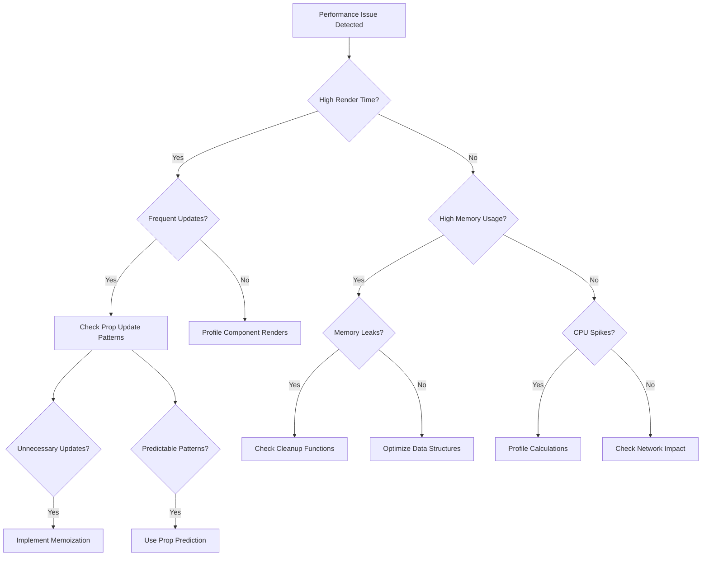

# Troubleshooting Guide

## Performance Issues Decision Tree



## Common Issues and Solutions

### 1. High Render Times (>16ms)

#### Symptoms
- Sluggish UI response
- Frame drops
- Cascading updates

#### Diagnostic Steps
1. Check prop update frequency:
```typescript
const metrics = PropAnalyzer.getInstance().getMetrics();
console.log(metrics.updateFrequency);
```

2. Analyze component render times:
```typescript
PropAnalyzer.getInstance().enableProfiling();
// Perform actions
const profile = PropAnalyzer.getInstance().getProfile();
```

#### Solutions

a) For frequent prop updates:
```typescript
// Before
function Component({ data }) {
  return <div>{data.value}</div>;
}

// After
const Component = React.memo(({ data }) => {
  return <div>{data.value}</div>;
}, (prev, next) => prev.data.value === next.data.value);
```

b) For expensive calculations:
```typescript
// Before
function Component({ data }) {
  const processed = processData(data);
  return <div>{processed}</div>;
}

// After
function Component({ data }) {
  const processed = useMemo(() => processData(data), [data]);
  return <div>{processed}</div>;
}
```

### 2. Memory Issues

#### Symptoms
- Increasing memory usage
- Browser tab crashes
- Slow garbage collection

#### Diagnostic Steps
1. Check memory metrics:
```typescript
const metrics = PropAnalyzer.getInstance().getMetrics();
console.log(metrics.memoryUsage);
```

2. Monitor prop history size:
```typescript
const history = PropAnalyzer.getInstance().getPropHistory();
console.log(history.size);
```

#### Solutions

a) Implement cleanup:
```typescript
useEffect(() => {
  return () => {
    PropAnalyzer.getInstance().cleanupHistory({
      maxAge: 3600000, // 1 hour
    });
  };
}, []);
```

b) Optimize data structures:
```typescript
// Before
const [data, setData] = useState(() => new Array(1000).fill(0));

// After
const data = useMemo(() => new Array(1000).fill(0), []);
```

### 3. Prop Pattern Issues

#### Symptoms
- Unpredictable updates
- Poor prop value predictions
- Inefficient memoization

#### Diagnostic Steps
1. Analyze prop patterns:
```typescript
const patterns = PropAnalyzer.getInstance().analyzePropPatterns();
console.log(patterns);
```

2. Check prediction accuracy:
```typescript
const predictions = PropAnalyzer.getInstance().getPropPredictions();
console.log(predictions.accuracy);
```

#### Solutions

a) Improve prop stability:
```typescript
// Before
function Parent() {
  return <Child onEvent={() => {}} />;
}

// After
function Parent() {
  const handler = useCallback(() => {}, []);
  return <Child onEvent={handler} />;
}
```

b) Implement better patterns:
```typescript
// Before
function Component({ value, onChange }) {
  return <input value={value} onChange={onChange} />;
}

// After
function Component({ value, onChange }) {
  const handleChange = useCallback((e) => {
    onChange(e.target.value);
  }, [onChange]);

  return <input value={value} onChange={handleChange} />;
}
```

### 4. Integration Issues

#### Symptoms
- Missing metrics in external tools
- Incomplete monitoring data
- Configuration errors

#### Diagnostic Steps
1. Verify integration setup:
```typescript
const integration = ExternalIntegrationService.getInstance();
console.log(integration.getStatus());
```

2. Check API connectivity:
```typescript
ExternalIntegrationService.getInstance().testConnection()
  .then(result => console.log('Connection status:', result));
```

#### Solutions

a) Fix configuration:
```typescript
ExternalIntegrationService.getInstance().addCustomIntegration('newrelic', {
  type: 'newrelic',
  apiKey: process.env.REACT_APP_NEW_RELIC_LICENSE_KEY,
  customConfig: {
    enabled: true,
    debug: true,
  },
});
```

b) Implement error handling:
```typescript
ExternalIntegrationService.getInstance()
  .on('error', (error) => {
    console.error('Integration error:', error);
    // Implement fallback or retry logic
  });
```

## Performance Budgets

Use these as guidelines for optimal performance:

```typescript
const recommendedBudgets = {
  renderTime: 16, // ms (60fps)
  memoryUsage: 50 * 1024 * 1024, // 50MB
  propUpdatesPerSecond: 100,
  predictionAccuracy: 0.8, // 80%
};
```

## Next Steps

If issues persist after following this guide:

1. Check the [Performance Case Studies](./case-studies.md)
2. Review [API Documentation](./api-reference.md)
3. Join our [Discord Community](https://discord.gg/prop-analysis)
4. File an issue on [GitHub](https://github.com/prop-analysis/tools/issues) 