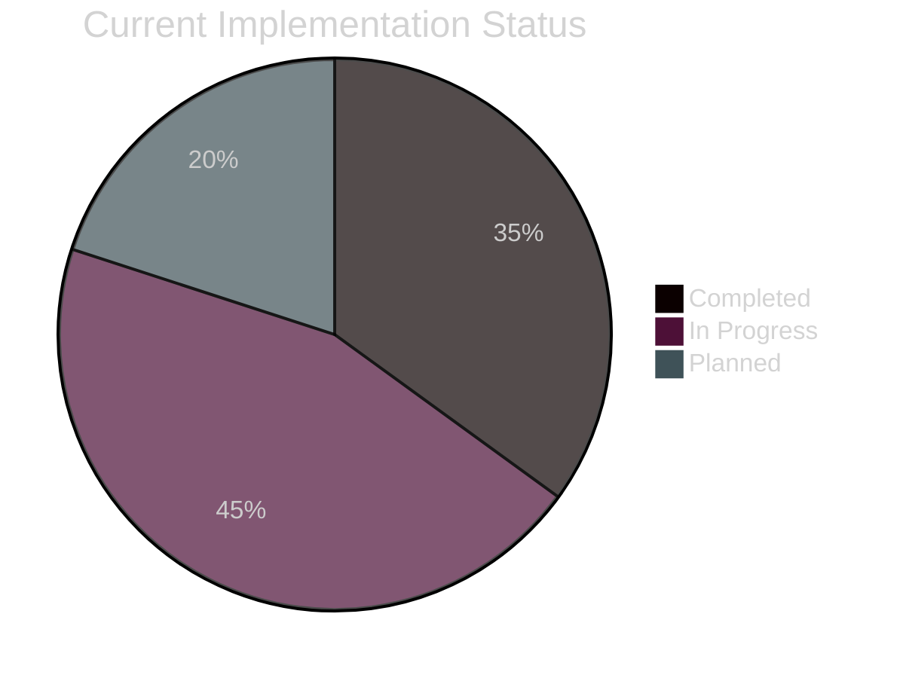
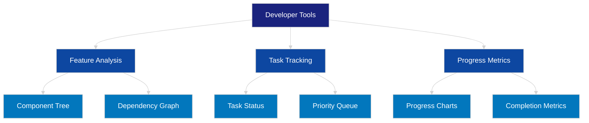

# Developer Tools Requirements

## Overview
The Developer Tools component provides real-time insights into the application's feature implementation status, task progress, and component dependencies through an interactive interface.

## Core Features

### 1. Feature Analysis
- Component dependency visualization
- Real-time feature status tracking
- Implementation progress metrics
- Visual component tree representation

### 2. Task Progress Tracking
- Interactive progress charts
- Task status visualization
- Priority queue management
- Completion metrics display

### 3. Implementation Status
- Real-time status updates
- Component-level progress tracking
- Integration with existing workflow system
- Dependency relationship visualization

## Technical Requirements

### UI Components
- Expandable side panel
- Dark theme integration
- Interactive charts and diagrams
- Real-time data updates

### Performance
- Minimal impact on main application
- Efficient data visualization
- Optimized rendering for large datasets
- Smooth transitions and animations

### Integration
- Seamless workflow system integration
- Real-time data synchronization
- Event-driven updates
- Non-blocking operations

## Progress Visualization

## Component Architecture

