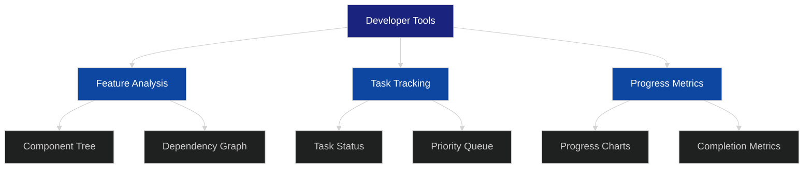
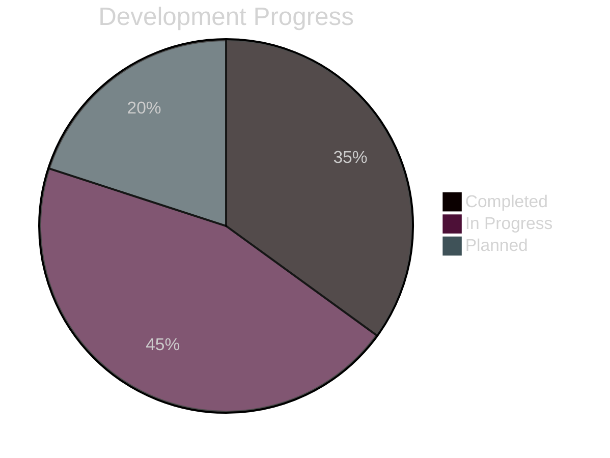

# Developer Tools Documentation

## Overview
The Developer Tools feature provides real-time insights into project features, tasks, and progress through an interactive interface accessible from the main application.

## UI Components
### Developer Tools Button
- Location: Upper-right corner of navigation bar
- Appearance: Icon button with tooltip
- Tooltip text: "Developer Tools - Task & Feature Analysis"

### Developer Tools Panel
- Expandable side panel
- Dark theme consistent with application styling
- Sections:
  - Feature Analysis
  - Task Progress
  - Implementation Status

## Features
### Feature Analysis

### Task Progress Integration

## Implementation Tasks
- [ ] Add developer tools button to navigation bar
- [ ] Create expandable side panel component
- [ ] Implement feature analysis visualization
- [ ] Add task progress tracking
- [ ] Integrate with existing workflow system
- [ ] Add real-time progress updates
- [ ] Implement component dependency visualization

## Technical Requirements
- React-based implementation
- Integration with existing state management
- Real-time data updates
- Responsive design support
- Performance optimization for large datasets

## Dependencies
- Existing workflow system
- State management system
- UI component library
- Visualization libraries for charts and graphs

## Security Considerations
- Developer tools access control
- Data sensitivity handling
- Performance impact monitoring