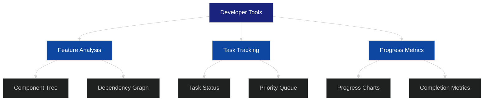
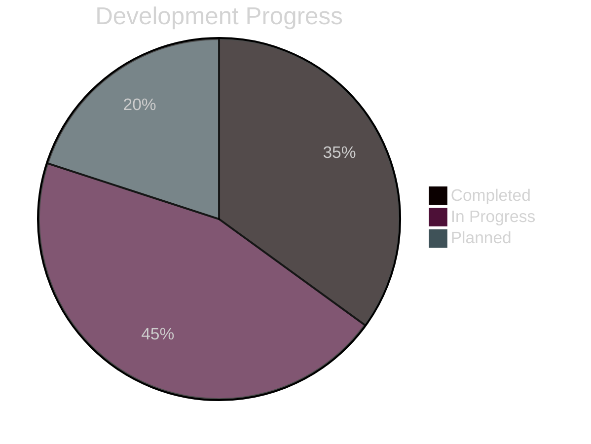

# Developer Tools Documentation

## Overview
The Developer Tools feature provides real-time insights into project features, tasks, and progress through an interactive interface accessible from the main application.

## UI Components
### Developer Tools Button
- Location: Fixed position in the upper-right corner of the viewport
- Implementation: Material-UI IconButton with Tooltip
- Icon: Settings icon from MUI Icons
- Styling: 
  - Subtle background color (rgba(0, 0, 0, 0.4))
  - Primary color accent
  - Box shadow for subtle glow effect
  - Hover animation with increased glow
- Tooltip text: "Developer Tools - Task & Feature Analysis"
- Accessibility: Proper aria-label attributes

```jsx
// Implementation with Material-UI
<Tooltip title="Developer Tools - Task & Feature Analysis" arrow placement="left">
  <IconButton
    aria-label="Developer Tools"
    color="primary"
    sx={{
      position: 'fixed',
      top: '16px',
      right: '16px',
      zIndex: 9999,
      backgroundColor: 'rgba(0, 0, 0, 0.4)',
      '&:hover': {
        backgroundColor: 'rgba(59, 130, 246, 0.2)',
        boxShadow: '0 0 12px rgba(59, 130, 246, 0.3)',
      },
      boxShadow: '0 0 8px rgba(59, 130, 246, 0.2)',
    }}
  >
    <SettingsIcon />
  </IconButton>
</Tooltip>
```

### Developer Tools Panel
- Expandable side panel using Material-UI Drawer component
- Dark theme consistent with application styling (via MUI ThemeProvider)
- Sections:
  - Feature Analysis
  - Task Progress
  - Implementation Status

## Features
### Feature Analysis


### Task Progress Integration


## Implementation Tasks
- [x] Add developer tools button to the UI
- [x] Implement fixed positioning in the upper-right corner
- [x] Add tooltip functionality with Material-UI
- [x] Implement themed styling with Material-UI
- [ ] Create expandable side panel using MUI Drawer
- [ ] Implement feature analysis visualization with Recharts
- [ ] Add task progress tracking
- [ ] Integrate with existing workflow system
- [ ] Add real-time progress updates
- [ ] Implement component dependency visualization

## Technical Requirements
- React/Material-UI implementation
- Integration with existing state management
- Real-time data updates
- Responsive design through MUI components
- Performance optimization for large datasets
- Proper z-index management for UI layers
- Accessibility compliance with WCAG standards
- Mobile-responsive button placement
- Theme integration with MUI ThemeProvider

## Dependencies
- Material-UI core components
- Material-UI icons
- Recharts for data visualization
- Existing workflow system
- State management system
- Themed styling system

## Future Enhancements
- Advanced filtering options for task views
- Interactive component tree visualization
- Drag-and-drop task prioritization
- Export functionality for reports
- Team collaboration features

## Security Considerations
- Developer tools access control
- Data sensitivity handling
- Performance impact monitoring