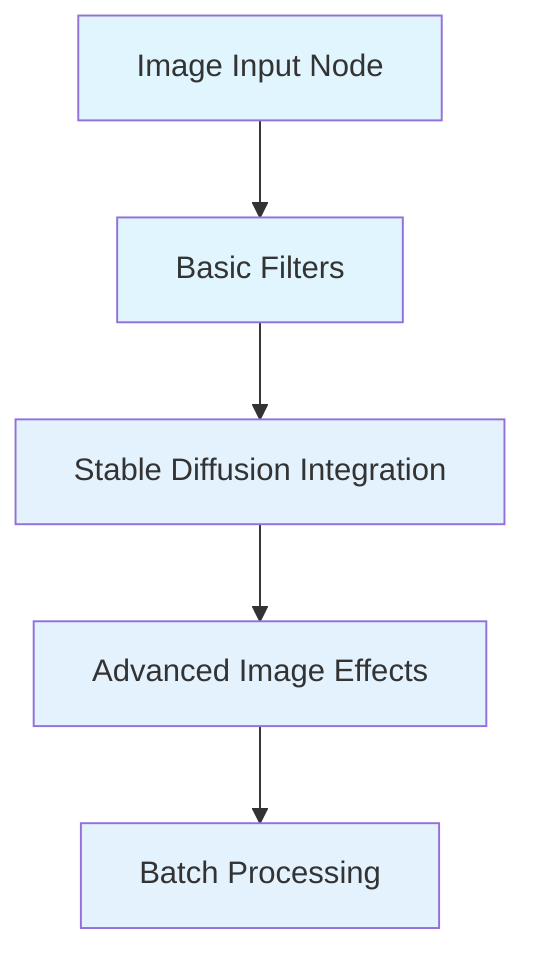
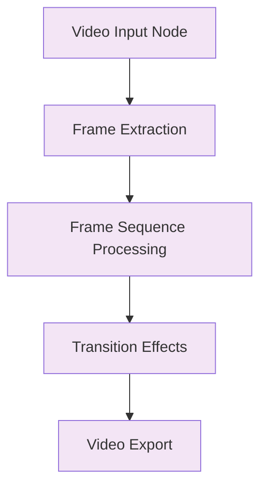
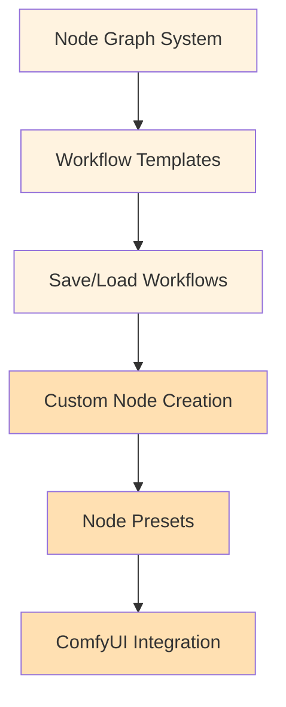
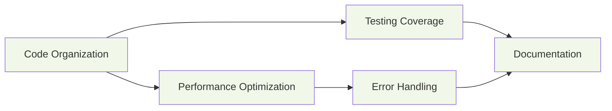
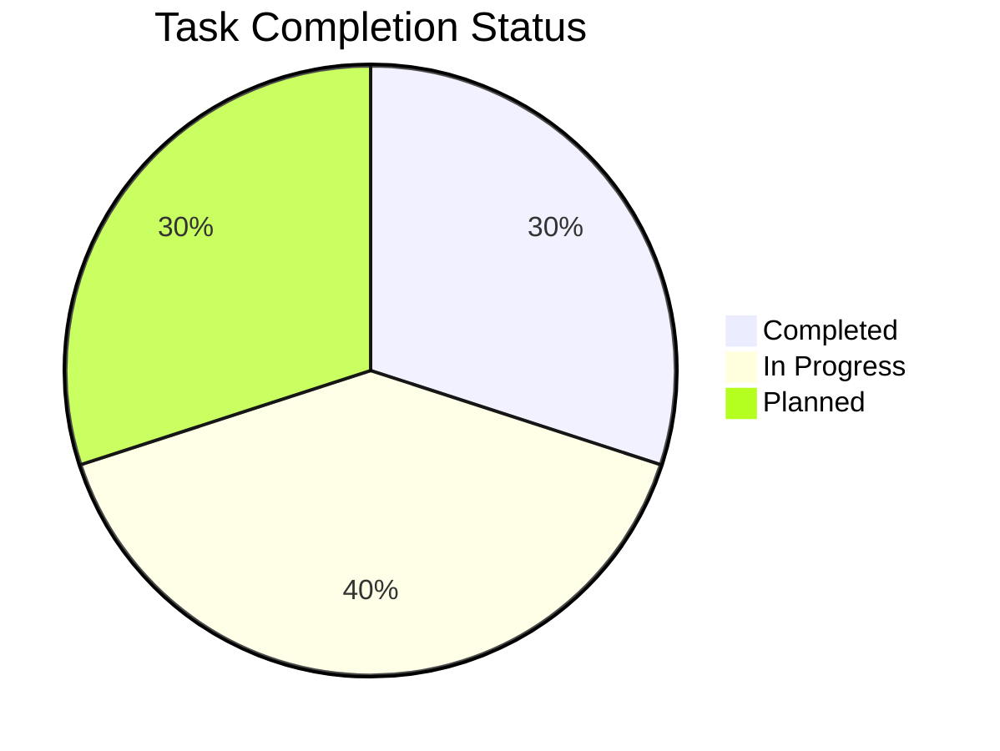
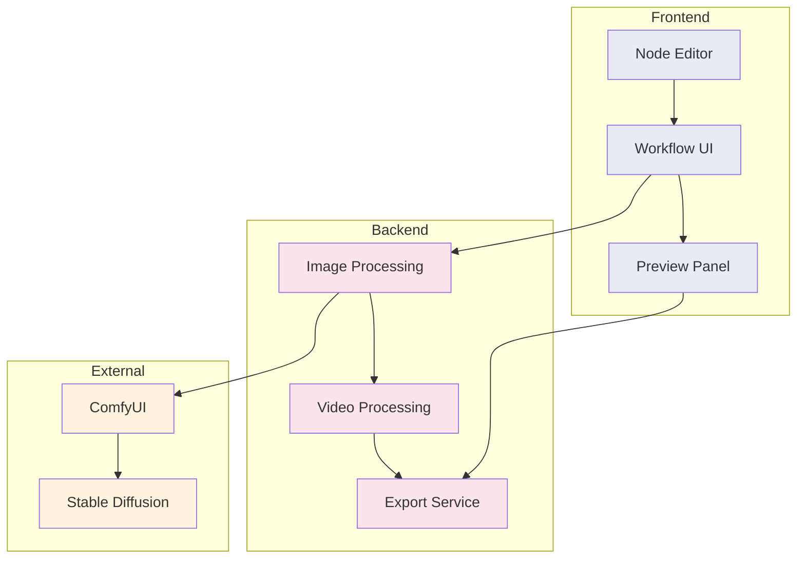

# ImagN Task Visualization

This document provides a visual representation of our task lists organized by features and refactoring efforts.

## Feature-based Task Organization

### Image Processing Features

### Video Processing Features

### Workflow Management

## Refactoring Efforts

## Implementation Progress

## Dependencies and Integration Points

## Notes
- Colors indicate feature groupings and progress status
- Node sizes represent estimated complexity
- Arrows show dependencies and workflow direction
- Pie chart shows overall project progress