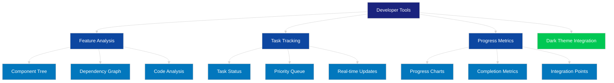
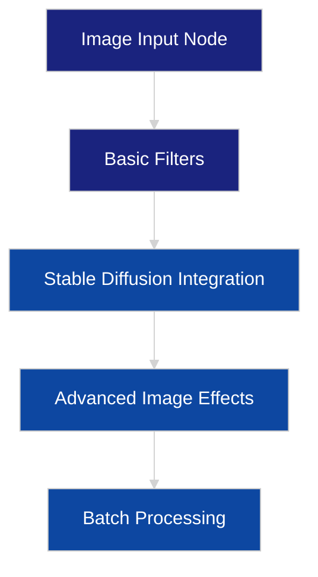
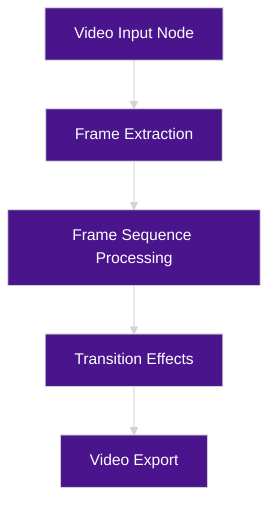
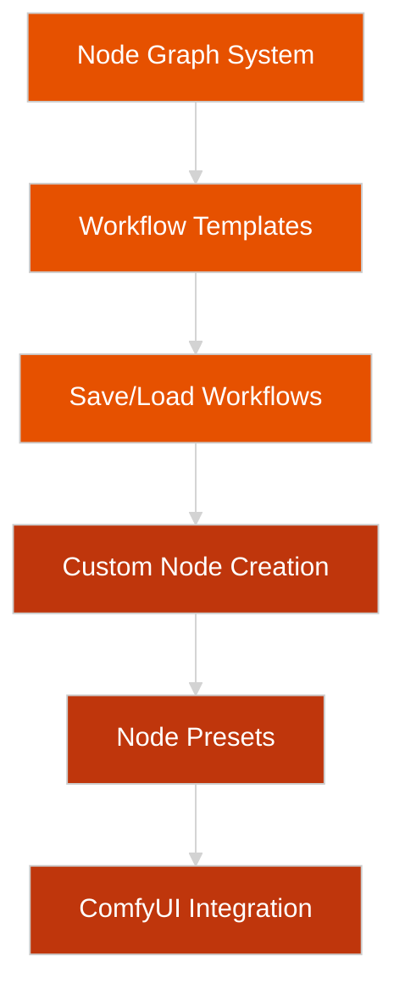
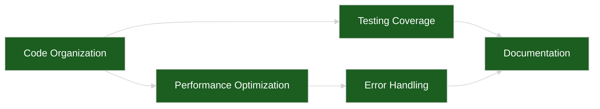
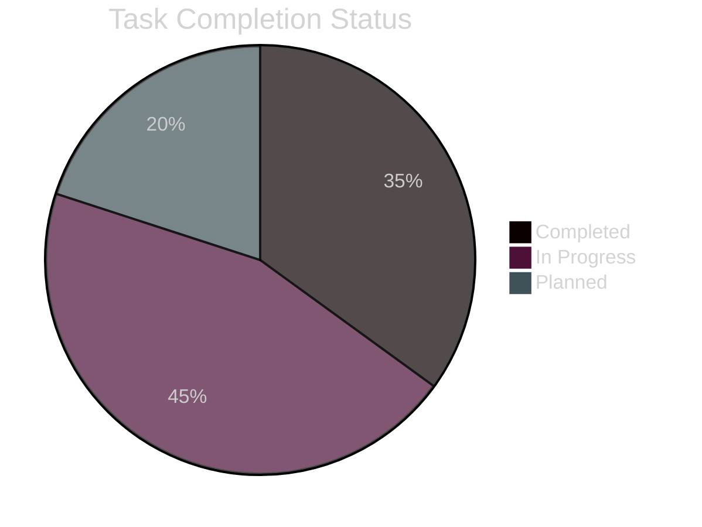
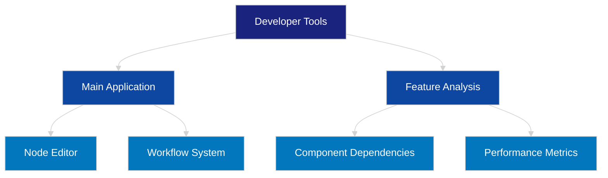

# ImagN Task Visualization

This document provides a visual representation of our task lists organized by features and refactoring efforts.

## Developer Tools Implementation

## Feature-based Task Organization

### Image Processing Features

### Video Processing Features

### Workflow Management

## Refactoring Efforts

## Implementation Progress

## Dependencies and Integration Points

